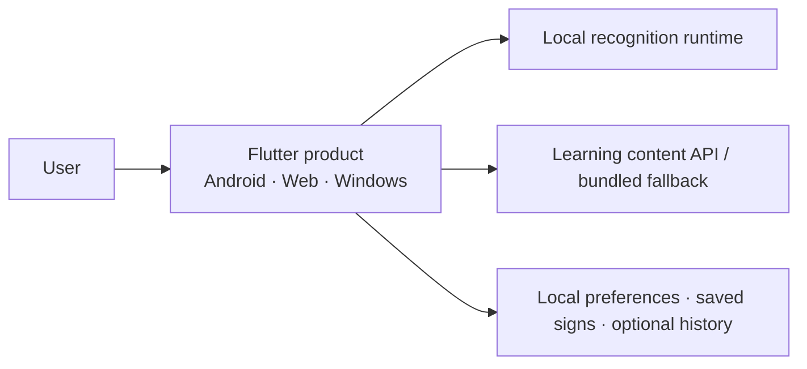

# Architecture

Parlons LSQ Runtime v1.5 is a **local-first multi-platform runtime** built around a frozen historical 29-class isolated-sign classifier.

The architecture separates three things deliberately:

1. **Research/model contract** — the frozen model, temporal input and compatibility feature schema.
2. **Product experience** — camera lifecycle, recognition states, learning content, history, localization and accessibility.
3. **Future research generation** — new data, representations and larger models that should not silently rewrite the v1.5 baseline.

## System context



Normal recognition does not depend on an HTTP inference endpoint in Runtime v1.5.

## Frozen recognition contract

| Property | Runtime v1.5 |
|---|---|
| Engine | `prototype-lsq-29-v1` |
| Task | Isolated-sign classification |
| Classes | 29 |
| Input | `64 × 228` |
| Feature schema | `legacy-mediapipe-228-v1` |
| Reference model | Frozen historical H5 |
| Product derivative | Fixed-batch TFLite/LiteRT where required |
| Output semantics | Raw classifier scores |
| Trained unknown detector | None |

Shared conceptual pipeline:


## Recognition state model

Recognition is treated as a lifecycle rather than a single camera button:

```text
permission required
→ initializing
→ ready
→ positioning
→ capturing
→ processing
→ recognized / uncertain / unknown / insufficient input
```

Lifecycle interruption and runtime/hardware failures remain explicit recoverable states.

## Android

Android keeps the complete inference path on device:

```text
CameraImage
→ native MediaPipe Tasks in IMAGE mode
→ timestamped 228-D observations
→ fixed recognition window
→ temporal resampling to 64 × 228
→ local LiteRT/TFLite
→ shared product result
```

The app starts from its preferred camera and exposes **camera switching when multiple cameras are available**. Switching is allowed only from the safe ready state, not in the middle of capture or processing.

## Web

The Web target uses a short local browser clip:

```text
browser camera
→ short local clip
→ browser decode
→ MediaPipe Tasks WASM
→ 228-D observations
→ temporal resampling
→ LiteRT.js WASM
→ shared product result
```

Recognition stays in the browser. Runtime v1.5 does not require a TFJS recognition bridge or remote recognition server.

## Windows

The Windows target uses a local persistent worker adapter:

```text
Flutter camera clip
→ local stdin/stdout JSON-lines bridge
→ persistent Python worker
→ OpenCV + MediaPipe Tasks
→ temporal resampling
→ frozen H5 classifier
→ shared product result
```

The worker remains local and does not open an HTTP recognition port.

## Backend boundary

The active FastAPI surface is intentionally small:

```text
GET /api/v1/health
GET /api/v1/ready
GET /api/v1/signs
GET /api/v1/signs/{sign_id}
```

The Backend also retains model/reference utilities, parity/evaluation tooling and the Windows worker. In addition, it now preserves a **transport-neutral remote-recognition contract** for a future large or sensitive model. That seam is dormant in Runtime v1.5: it is not mounted as an HTTP recognition route and does not change the current local product behavior.

This gives the project a clean future path:

```text
current compact model → local inference
future larger model   → local / secure hosted / hybrid, chosen from actual constraints
```

## Learning and recognition are separate

Learning content is not forced to match the 29 recognition classes. A sign can be useful educational content even when the frozen classifier does not support it.

The app can use versioned learning content and a bundled read-only fallback, so a missing content service does not make the learning surface unusable.

## Local state and privacy

The application may keep:

- interface preferences;
- saved signs;
- optional recognition-result history.

Ordinary local history excludes camera frames, video clips, MediaPipe landmarks and 228-D feature tensors. Recognition media/features are temporary runtime inputs.

## Localization and accessibility

The product supports French, English and Arabic, including RTL presentation for Arabic, plus responsive layout behavior, stronger contrast preferences and reduced-motion preferences.

## Architectural principles

- **Freeze before scaling.** The historical model and feature contract remain identifiable and reproducible.
- **One result contract, different platform runtimes.** Presentation code does not need to understand MediaPipe/TensorFlow/LiteRT details.
- **Local by default for v1.5.** Privacy and latency stay simple while the model is compact enough to ship.
- **Do not confuse compatibility code with future research architecture.** `legacy-mediapipe-228-v1` exists to reproduce the first model, not to dictate the next one.
- **Preserve an upgrade seam.** A future model can move server-side or hybrid without resurrecting an old development endpoint as production architecture.

## Source boundary

Detailed implementation lives in private repositories. This document describes reviewed architecture without distributing private source, model binaries, credentials or research datasets.

Exact represented revisions are recorded in [BUILD_MANIFEST.md](BUILD_MANIFEST.md).
