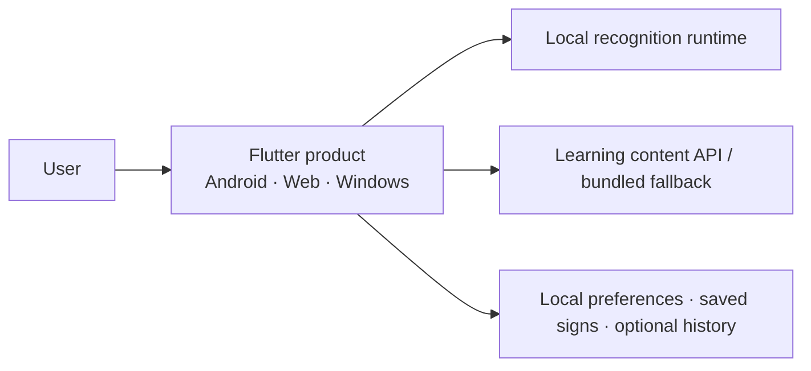

# Architecture

Parlons LSQ Runtime v1.5 is a **local-first multi-platform runtime** built around a frozen 29-class isolated-sign classifier.

The architecture keeps three layers distinct:

1. **Research/model contract** — the frozen model, temporal input, and compatibility feature schema.
2. **Product experience** — camera lifecycle, recognition states, learning content, history, localization, and accessibility.
3. **Future research generation** — new data, representations, and larger models that can evolve without rewriting the v1.5 baseline.

## System context



Runtime v1.5 keeps recognition local and uses the Backend separately for content and reference tooling.

## Frozen recognition contract

| Property | Runtime v1.5 |
|---|---|
| Engine | `prototype-lsq-29-v1` |
| Task | Isolated-sign classification |
| Classes | 29 |
| Input | `64 × 228` |
| Feature schema | `legacy-mediapipe-228-v1` |
| Reference model | Frozen historical H5 |
| Product derivative | Fixed-batch TFLite/LiteRT where required |
| Output semantics | Raw classifier scores |
| Open-set detector | Outside the v1.5 scope |

Shared conceptual pipeline:


## Recognition lifecycle

Recognition is represented as a sequence of explicit states:

```text
permission required
→ initializing
→ ready
→ positioning
→ capturing
→ processing
→ recognized / uncertain / unknown / insufficient input
```

That shared lifecycle lets each platform use its own ML runtime while the product behaves consistently.

## Android

Android keeps the complete inference path on device:

```text
CameraImage
→ native MediaPipe Tasks in IMAGE mode
→ timestamped 228-D observations
→ fixed recognition window
→ temporal resampling to 64 × 228
→ local LiteRT/TFLite
→ shared product result
```

The app starts from its preferred camera and exposes **camera switching when multiple cameras are available**. Switching is restricted to the ready state so capture and inference are not interrupted mid-attempt.

## Web

The Web target uses a short local browser clip:

```text
browser camera
→ short local clip
→ browser decode
→ MediaPipe Tasks WASM
→ 228-D observations
→ temporal resampling
→ LiteRT.js WASM
→ shared product result
```

The complete recognition path remains inside the browser runtime.

## Windows

The Windows target uses a local persistent worker:

```text
Flutter camera clip
→ local stdin/stdout JSON-lines bridge
→ persistent Python worker
→ OpenCV + MediaPipe Tasks
→ temporal resampling
→ frozen H5 classifier
→ shared product result
```

This keeps the reference H5 path available locally while preserving the same product-level result contract used by the other platforms.

## Backend

The active FastAPI surface handles service health/readiness and versioned learning content:

```text
GET /api/v1/health
GET /api/v1/ready
GET /api/v1/signs
GET /api/v1/signs/{sign_id}
```

The Backend also contains model/reference utilities, parity/evaluation tooling, the Windows worker, and a **transport-neutral remote-recognition contract** reserved for a future model that may be too large or sensitive to ship entirely on-device.

That gives the project a clean deployment path across generations:

```text
compact model → local inference
larger model  → local / secure hosted / hybrid, chosen from actual constraints
```

## Learning and recognition

Learning content is broader than the classifier vocabulary. A sign can be useful educational content even when it is outside the 29 recognition classes.

The app can use versioned learning content with a bundled read-only fallback, keeping the learning surface usable independently from the ML runtime.

## Local state and privacy

The application may keep interface preferences, saved signs, and optional recognition-result history. Camera frames, video clips, MediaPipe landmarks, and 228-D feature tensors remain temporary recognition inputs rather than ordinary history records.

## Localization and accessibility

The product supports French, English, and Arabic with RTL presentation, responsive layouts, stronger contrast preferences, and reduced-motion preferences.

## Architectural principles

- **Freeze before scaling.** The first model and feature contract remain identifiable and reproducible.
- **One result contract, different runtimes.** Platform-specific ML details stay below the product layer.
- **Local-first for v1.5.** The compact model makes on-device/browser inference practical.
- **Compatibility is not destiny.** `legacy-mediapipe-228-v1` preserves the first model; it does not constrain the next one.
- **Keep an upgrade seam.** Future large-model deployment can evolve without rewriting the current application architecture.

## Source boundary

Detailed implementation lives in private repositories. Exact represented revisions are recorded in [BUILD_MANIFEST.md](BUILD_MANIFEST.md), with selected review access described in [ACCESS.md](ACCESS.md).
