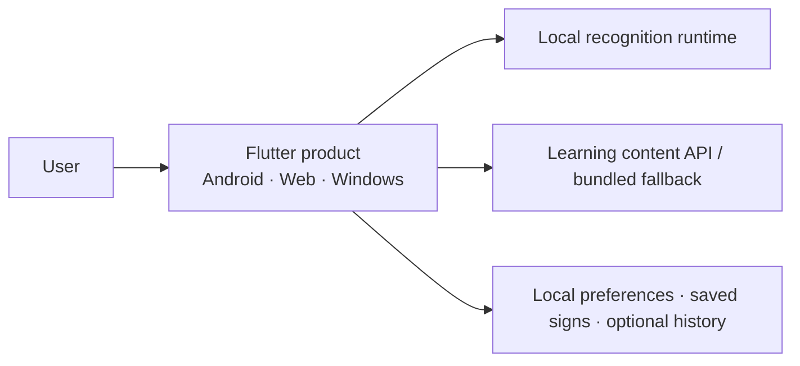

# Architecture

Parlons LSQ Runtime v1.5 is a **local-first, multi-platform compatibility runtime** around a frozen historical 29-class isolated-sign classifier.

The architecture intentionally separates three concerns:

1. the **product experience** — learning, recognition, settings, history, localization;
2. the **frozen compatibility runtime** — reproduce the historical model correctly on Android, Web, and Windows;
3. the **future research program** — new datasets, representations, and larger models that must not silently change Runtime v1.5 claims.

## System context



The application has no normal recognition HTTP endpoint. Learning content and recognition are deliberately separate surfaces.

## Shared product flow

```text
Home
├── Recognize
├── Signs
│   ├── search / categories / saved
│   ├── sign detail
│   └── practice
└── You
    ├── settings
    ├── optional local recognition history
    └── privacy and data
```

Recognition is state-driven rather than treated as a single camera button:

```text
permission required
→ initializing
→ ready
→ positioning
→ capturing
→ processing
→ recognized / uncertain / unknown / insufficient input
```

Lifecycle interruption and hardware/runtime failures are explicit recoverable states.

## Frozen recognition contract

| Property | Runtime v1.5 |
|---|---|
| Engine | `prototype-lsq-29-v1` |
| Task | isolated-sign classification |
| Classes | 29 |
| Input | `64 × 228` |
| Feature schema | `legacy-mediapipe-228-v1` |
| Model source | frozen historical H5 |
| Product derivative | fixed-batch TFLite/LiteRT where required |
| Output semantics | raw classifier scores |
| Unknown detector | none |

The shared pipeline is:


## Android runtime

Android uses the camera stream directly and keeps inference local.

```text
CameraImage
→ native MediaPipe Tasks in image mode
→ timestamped 228-D observations
→ fixed recognition window
→ temporal resampling to 64 × 228
→ local LiteRT/TFLite
→ shared product result
```

The app prefers the front camera for the frozen validation target. Back-camera handedness semantics are intentionally not promoted into a release claim without cross-platform parity evidence.

## Web runtime

The Web target uses a short local browser clip because browser camera/perception constraints differ from native Android.

```text
browser camera
→ short local clip
→ browser decode
→ MediaPipe Tasks WASM
→ 228-D observations
→ temporal resampling
→ LiteRT.js WASM
→ shared product result
```

Recognition stays in the browser. No TFJS recognition bridge and no recognition backend are required for the retained Runtime v1.5 path.

## Windows development runtime

The Windows product target uses a local worker adapter during Runtime v1.5 development:

```text
Flutter camera clip
→ local stdin/stdout JSON-lines bridge
→ persistent Python worker
→ OpenCV + MediaPipe Tasks
→ temporal resampling
→ frozen H5 classifier
→ shared product result
```

The worker does not expose an HTTP recognition service. It exists to preserve a reproducible local reference path while the Windows-native ML packaging strategy remains outside the frozen product claim.

## Backend boundary

The retained FastAPI HTTP surface is intentionally small:

```text
GET /api/v1/health
GET /api/v1/ready
GET /api/v1/signs
GET /api/v1/signs/{sign_id}
```

TensorFlow and MediaPipe are not part of normal FastAPI startup. The Backend repository also owns reference/evaluation tooling and the Windows local worker, but it is **not** the product recognition server.

## Learning resilience

Learning content is independent from model support.

The product can display the learning catalogue through its canonical content source and retain a bundled read-only fallback so a missing content service does not make the learning UI unusable.

This matters because the 29 recognition classes and the learning product should not be mistaken for the same boundary.

## Local state and privacy

The application may keep:

- interface preferences;
- saved signs;
- optional recognition-result history.

The ordinary history contract excludes:

- camera frames;
- video clips;
- MediaPipe landmarks;
- 228-D feature tensors.

Recognition media/features are temporary runtime inputs, not normal product-history records.

## Localization and accessibility

The product supports:

- French;
- English;
- Arabic;
- RTL presentation for Arabic;
- larger text/responsive layout behavior;
- increased contrast preference;
- reduced-motion preference.

These concerns are part of the product architecture rather than post-release decoration because sign-language interaction often already places significant visual demand on the user.

## Important architectural decisions

### 1. Freeze the historical prototype before expanding research

The recovered model, exact feature schema, and platform derivatives are kept identifiable and testable. New research does not silently replace the baseline.

### 2. Keep recognition local

Local recognition improves the privacy boundary and avoids coupling a camera interaction to network availability or a recognition API.

### 3. Use one product result contract across platform-specific runtimes

Android, Web, and Windows differ internally, but presentation code should not need to understand MediaPipe, TensorFlow, or LiteRT details.

### 4. Separate learning content from recognition support

A sign can be useful educational content even when the frozen classifier cannot recognize it.

### 5. Treat uncertainty as a product state

The app does not reduce the entire recognition experience to a confident-looking label. Uncertain, unknown, insufficient-input, interrupted, and unavailable states remain visible.

### 6. Do not turn compatibility code into future research architecture

The `legacy-mediapipe-228-v1` representation exists to reproduce the historical classifier. Future LSQ work can replace it without rewriting what Runtime v1.5 was.

## Source boundary

The detailed implementation lives in private repositories. This public architecture document describes reviewed behavior and boundaries without distributing private source, model binaries, credentials, or research datasets.

Exact represented revisions are recorded in [BUILD_MANIFEST.md](BUILD_MANIFEST.md).
