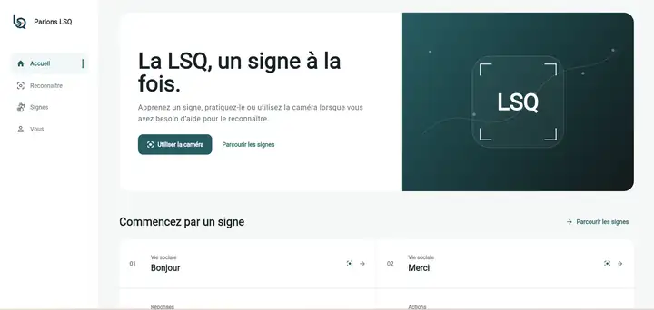
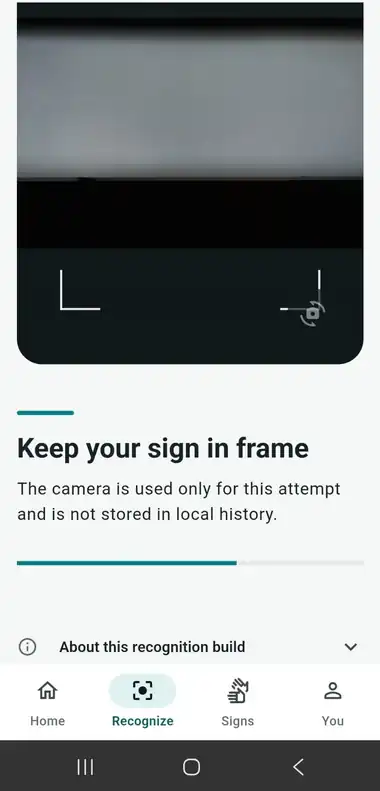
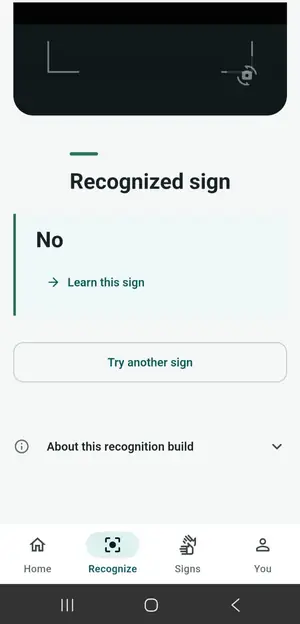
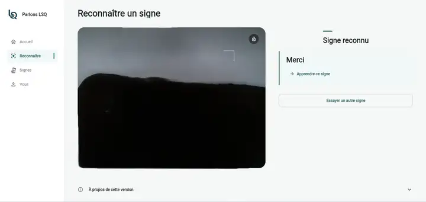
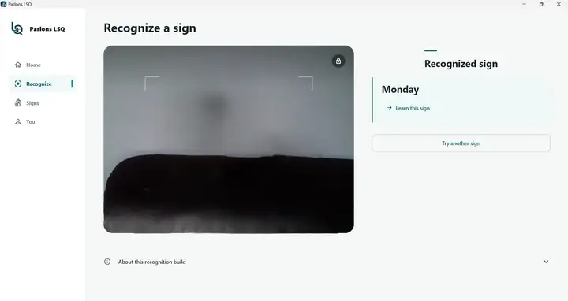
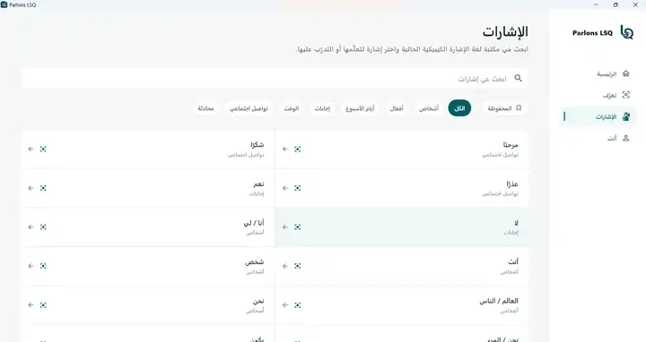

# Parlons LSQ

**From a hand-built LSQ dataset to a reproducible local AI prototype running on Android, Web and Windows.**



Parlons LSQ is a research-engineering project exploring computer-vision recognition for **Langue des signes québécoise (LSQ)**. The first generation started with a focused challenge: collect isolated-sign examples, turn motion into a reproducible numerical representation, train a temporal classifier, and carry that model all the way into working software.

Runtime v1.5 is the first frozen checkpoint. It recognizes **29 isolated signs** through a `64 × 228` temporal input and runs locally on the three product targets developed for the project. The application is the visible layer of a larger story about data, representation design, machine learning, reproducibility, deployment, and what comes next.

## At a glance

| | Runtime v1.5 |
|---|---|
| Research task | Experimental isolated-sign LSQ classification |
| Frozen engine | `prototype-lsq-29-v1` |
| Vocabulary | 29 historical classes |
| Model input | `64 × 228` |
| Feature contract | `legacy-mediapipe-228-v1` |
| Product targets | Android · Web · Windows |
| Recognition path | Local/offline |
| Interface | French · English · Arabic/RTL |
| Implementation | Private source; selected technical review available case-by-case |

## The idea

The original prototype was built as a complete ML pipeline rather than around an end-to-end pretrained sign-language model:

```text
isolated LSQ clips
        ↓
MediaPipe landmarks
        ↓
228-D compatibility representation per observation
        ↓
temporal normalization to 64 steps
        ↓
29-class neural classifier
        ↓
frozen H5 reference
        ↓
platform-specific local inference
        ↓
Android · Web · Windows
```

That path connects **data collection, representation design, temporal modelling, model reproducibility, conversion/parity, platform ML integration, privacy, and product deployment** in one system.

For the runtime split, see [ARCHITECTURE.md](ARCHITECTURE.md). For the research story and next generation, see [RESEARCH.md](RESEARCH.md).

## What the first baseline taught us

The 29-class model became strong enough in development conditions to support a real recognition workflow and produced successful recognitions on inputs beyond the original capture set, including people and reference footage it had not been trained on.

The most useful lesson came from the conditions where reliability dropped. Signing speed, lighting, framing, distance, and camera/body position could move the input outside the variation represented in the original small dataset.

That finding shaped the next research step: **more varied data and a stronger representation matter more now than further polishing the same 29-class training set.** Runtime v1.5 therefore stays frozen as a reproducible baseline while the research moves forward.

A fuller discussion is in [EVIDENCE.md](EVIDENCE.md).

## See it running

### Android — local recognition on a physical phone

| Capture in progress | Recognition result |
|---|---|
|  |  |

The Android result shows a qualitative check using external LSQ reference footage. The source footage is not redistributed in this repository.

### Web — browser-local inference



### Windows — local reference-worker inference



For the Web and Windows captures, the camera preview was privacy-redacted after capture; the recognition result and application state were left unchanged.

### Arabic / RTL product surface



Arabic switches the product into a true RTL presentation across navigation, search, categories, alignment, and learning content.

## Cross-platform runtime

The frozen recognition contract is implemented differently on each platform:

```text
Android
CameraImage → native MediaPipe Tasks → 228-D observations → 64 steps → LiteRT/TFLite

Web
short local browser clip → MediaPipe Tasks WASM → 228-D observations → 64 steps → LiteRT.js WASM

Windows
short local clip → local stdio worker → OpenCV + MediaPipe Tasks → 64 steps → frozen H5
```

Runtime v1.5 keeps recognition local. The Backend handles learning content, reproducibility/evaluation tooling, the Windows local worker, and a future-ready remote-recognition contract for larger models.

A future LSQ model can remain local, move to secure hosted inference, or use a hybrid design depending on model size, latency, privacy, updateability, infrastructure cost, and model-protection needs.

## Current scope

Runtime v1.5 focuses on **29 isolated LSQ signs**. It serves as the project's first reproducible recognition baseline and cross-platform deployment reference.

Continuous signing, open-vocabulary recognition, calibrated uncertainty, broader signer-generalization studies, and larger sign-language models belong to later research generations with their own data and evaluation methodology.

## Frozen public snapshot

This showcase represents these private-source revisions:

- **Frontend:** `4ffa25aab11106a226c98787f567ca4eb3524fba`
- **Backend/reference:** `c33d480db666723bece607990a5ef1b64aac0cf3`
- **Frozen H5 SHA-256:** `98590d3b47e299db7966bdc1d51946de3049d51934280e320e6dfbb18fda8110`

The full provenance record is in [BUILD_MANIFEST.md](BUILD_MANIFEST.md).

## Where the project goes next

Runtime v1.5 establishes the full path from hand-built data to a reproducible AI system. The next research generation is about **scale, variation, and robustness**: broader LSQ data, more signers and sessions, stronger visual-temporal representations, and a model capable of supporting a much larger vocabulary under harder real-world conditions.

That work lives in the private research workspace so each generation can advance without rewriting the historical baseline. See [ROADMAP.md](ROADMAP.md).

## Source access

The Showcase is public; the Flutter application, Backend/reference implementation, platform ML code, model tooling, and active research repository remain private.

Serious technical reviewers, recruiters, research collaborators, or potential partners may contact **[@anes-dev-ml](https://github.com/anes-dev-ml)**. Selected read-only access can be considered case-by-case.

More detail: [ACCESS.md](ACCESS.md).

## Documentation

- [Architecture](ARCHITECTURE.md)
- [Research scope](RESEARCH.md)
- [Prototype results](EVIDENCE.md)
- [Privacy](PRIVACY.md)
- [Build manifest](BUILD_MANIFEST.md)
- [Roadmap](ROADMAP.md)
- [Release policy](RELEASES.md)
- [Source access](ACCESS.md)
- [Security](SECURITY.md)
- [License](LICENSE)

---

**A small model established the chain. The next model is where the research gets ambitious.**
