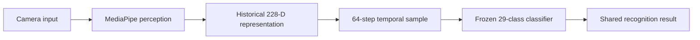

# Parlons LSQ

**An experimental LSQ learning and isolated-sign recognition project, built as a local-first Flutter product around a frozen 29-class research prototype.**

Parlons LSQ explores how a sign-language learning experience and an experimental recognition pipeline can live in one coherent product while keeping research claims, privacy boundaries, and future model work explicit.

> This repository is the **public showcase and technical case study** for Parlons LSQ. The active Flutter, Python, model-runtime, and research implementation repositories remain private. This showcase contains reviewed documentation, architecture, claim boundaries, provenance, and selected evidence rather than the application source code.

## Current snapshot

| Record | Value |
|---|---|
| Product runtime | Runtime v1.5 release candidate |
| Task | Isolated-sign LSQ recognition |
| Frozen engine | `prototype-lsq-29-v1` |
| Classes | 29 fixed historical classes |
| Input | `64 × 228` |
| Feature schema | `legacy-mediapipe-228-v1` |
| Frontend revision | `09d60a139ed81b84c6ca59ea1d70d6f1796816d7` |
| Backend/reference revision | `71c6d7dae280f6f207ccdf67048ecaf7e2af2571` |
| Supported product targets | Android · Web · Windows |
| Recognition transport | Local/offline; no recognition HTTP endpoint |
| Validation status | Implementation frozen; final controlled validation remains |

The current version is deliberately called an **experimental isolated-sign recognizer**, not a general LSQ translator. A working application is engineering evidence; it is not population-level accuracy evidence.

## What the product does

Parlons LSQ currently brings four user-facing areas into one interface:

- **Home** — orientation, quick access to recognition, learning suggestions, and an explicit privacy note;
- **Recognize** — camera-based isolated-sign recognition with visible ready, capture, processing, result, uncertain, unknown, and insufficient-input states;
- **Signs** — a searchable learning catalogue with categories, saved items, sign detail, and practice flows;
- **You** — local preferences, optional recognition history, accessibility controls, language settings, and privacy/data information.

The interface is available in **French, English, and Arabic**, including RTL presentation where appropriate.

## Product preview

Clean release-candidate screenshots are captured only from the final validation pass. The exact evidence plan lives in [EVIDENCE.md](EVIDENCE.md); debug or stale screenshots are intentionally excluded from this public case study.

Planned public evidence covers:

| Surface | Evidence |
|---|---|
| Home | wide desktop/web, compact layout, French and English |
| Recognition | ready/capture/result states on a physical Android device |
| Learning | sign library, detail, saved state, practice flow |
| Profile | privacy/data and settings |
| Localization | Arabic RTL and large-text/accessibility pass |
| Platform identity | Android launcher/splash, Web/PWA icon, Windows app icon |

## Local-first recognition architecture

The user interaction is intentionally consistent across platforms while the platform implementation differs underneath:



### Android

```text
CameraImage stream
→ native MediaPipe Tasks
→ sparse 228-D observations
→ fixed temporal window
→ resample to 64 × 228
→ local LiteRT/TFLite
```

### Web

```text
short local browser clip
→ MediaPipe Tasks WASM
→ 228-D observations
→ resample to 64 × 228
→ native LiteRT.js WASM
```

### Windows development runtime

```text
short local camera clip
→ local stdio Python worker
→ MediaPipe Tasks
→ resample to 64 × 228
→ frozen H5 classifier
```

Normal recognition does **not** send clips or feature tensors to a FastAPI recognition service. The backend HTTP surface is limited to health/readiness and versioned learning content.

Read [ARCHITECTURE.md](ARCHITECTURE.md) for the complete product/runtime boundary.

## Why the prototype matters

Parlons LSQ did not begin by downloading an end-to-end sign-language model. The historical prototype grew from a manually assembled pipeline:

```text
record isolated sign clips
→ extract MediaPipe landmarks
→ convert observations to a fixed numerical representation
→ save processed NumPy examples
→ build 64-step temporal samples
→ train a 29-class classifier
→ recover and freeze the historical H5 artifact
→ reproduce its exact feature encoder
→ build local Android/Web/Windows compatibility runtimes
```

That makes Runtime v1.5 useful for more than a demo: it is a **frozen baseline** whose behavior, representation, model identity, and limitations can be reproduced while future LSQ research evolves separately.

Read [RESEARCH.md](RESEARCH.md) for the scientific scope and the next research direction.

## What is intentionally *not* claimed

Parlons LSQ currently does not claim:

- continuous LSQ translation;
- fingerspelling recognition;
- open-set or unknown-sign recognition;
- calibrated confidence;
- population-level signer generalization;
- clinical or production validation;
- a large-scale LSQ language model.

The 228-D compatibility representation is preserved because the historical model depends on it. It is **not** presented as the final representation for future large-scale research.

## Privacy and trust boundary

Recognition and research participation are separate decisions.

- Android recognition stays on-device.
- Web recognition stays inside the browser runtime.
- Windows development recognition uses a temporary local clip and local stdio worker.
- Product history stores result metadata only when enabled; it does not store camera frames, clips, landmarks, or 228-D tensors.
- Recognition sessions are not automatically added to research datasets.
- Future research-data contribution must be an explicit opt-in workflow.

Read [PRIVACY.md](PRIVACY.md).

## Engineering highlights

| Area | Current implementation |
|---|---|
| Product UI | Flutter across Android, Web, and Windows |
| Localization | French, English, Arabic, RTL |
| Recognition contract | Shared typed result and state-driven session UX |
| Android runtime | Native MediaPipe + local LiteRT/TFLite |
| Web runtime | MediaPipe WASM + LiteRT.js WASM |
| Windows runtime | Local Python stdio worker + frozen H5 |
| Learning resilience | Versioned content source with bundled read-only fallback |
| Local state | Saved signs, preferences, optional recognition history |
| Privacy | Recognition media/features excluded from ordinary product history |
| Reproducibility | Frozen model identity, feature schema, parity/evaluation tooling |
| Claim discipline | Engineering evidence separated from research/generalization claims |

## Validation boundary

Runtime v1.5 implementation is frozen. The remaining validation gate includes:

1. repository checks and localization generation;
2. physical-device Android product testing;
3. Web and Windows runtime testing;
4. H5 ↔ TFLite parity;
5. matched cross-platform clip checks;
6. a predeclared **29-class × 5 attempts = 145-trial** controlled evaluation;
7. final latency/agreement and visual evidence capture.

No new feature or model work is planned for Runtime v1.5 unless a validation gate fails.

Read [EVIDENCE.md](EVIDENCE.md) and [BUILD_MANIFEST.md](BUILD_MANIFEST.md).

## Research direction

The frozen 29-class prototype is the first reproducible baseline, not the end goal.

The broader project direction is to investigate more scalable LSQ representation learning and recognition using substantially larger public/partner datasets, stronger visual-temporal encoders, cross-signer evaluation, and eventually a model whose scope is meaningfully larger than isolated prototype classes.

Future datasets, training experiments, model comparisons, and large-model methodology belong in the private `ParlonsLSQ-Research` workspace rather than being mixed into the frozen product runtime.

## Private source and access

The implementation repositories are intentionally private.

This public showcase is sufficient for normal portfolio review. For a serious technical review, research collaboration, recruitment process, or partnership discussion, **read-only access to selected private implementation material may be granted case-by-case**.

See [ACCESS.md](ACCESS.md) for the review boundary and contact path.

## Documentation map

| Document | Purpose |
|---|---|
| [Architecture](ARCHITECTURE.md) | Product, platform runtimes, trust boundaries, and design decisions |
| [Research](RESEARCH.md) | Frozen prototype, scientific claim boundary, and future research direction |
| [Evidence](EVIDENCE.md) | Validation status, evidence rules, and final capture plan |
| [Privacy](PRIVACY.md) | Recognition, history, research participation, and data boundaries |
| [Build manifest](BUILD_MANIFEST.md) | Exact private source revisions represented by this showcase |
| [Roadmap](ROADMAP.md) | What follows Runtime v1.5 without rewriting its claims |
| [Access](ACCESS.md) | Private-source review and contact policy |

## Project ownership

Parlons LSQ is designed and developed by **Anes** as a long-term sign-language research and engineering project spanning product development, computer vision, machine learning, reproducibility, and human-centered interaction.

## License

The documentation, diagrams, screenshots, branding, and approved public artifacts in this showcase are protected by the repository's [license](LICENSE). The private Frontend, Backend, and Research source repositories are not distributed or licensed through this repository.
